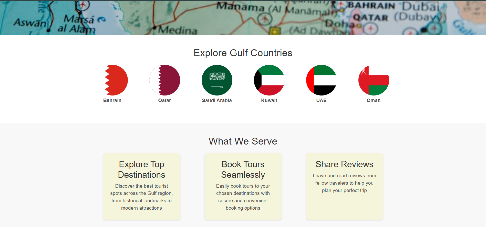
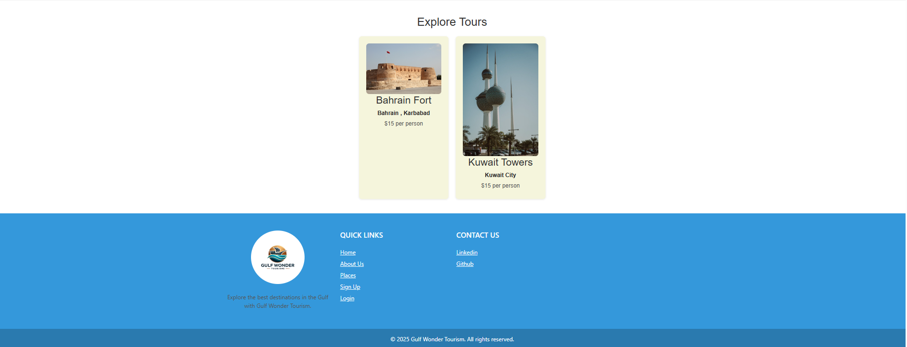
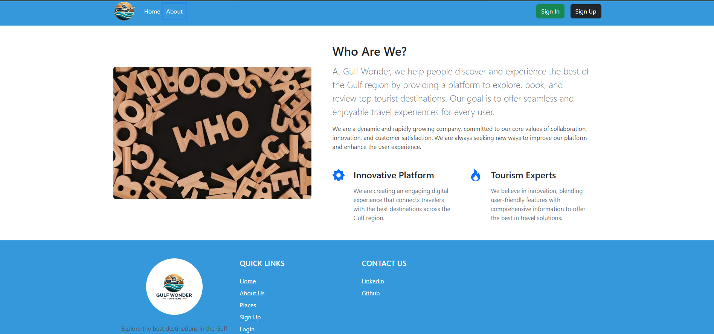
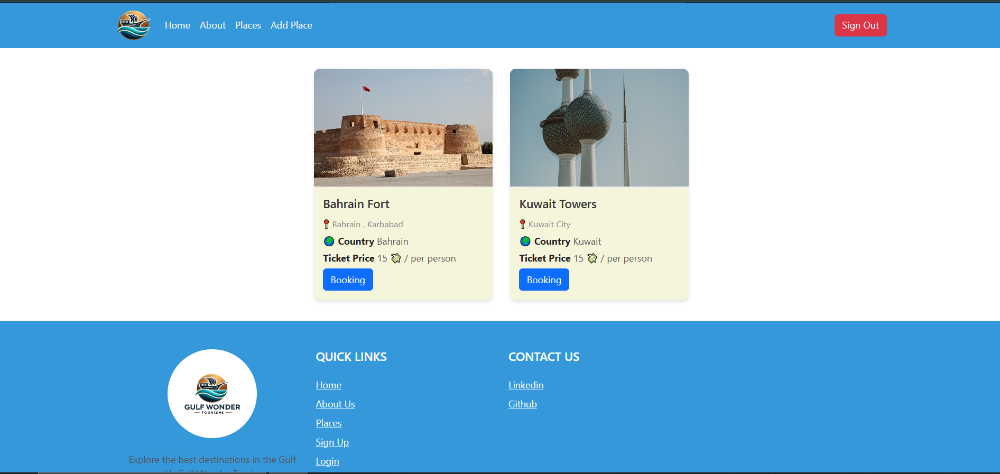
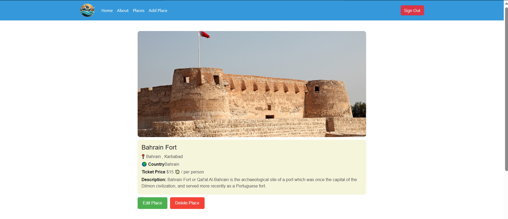
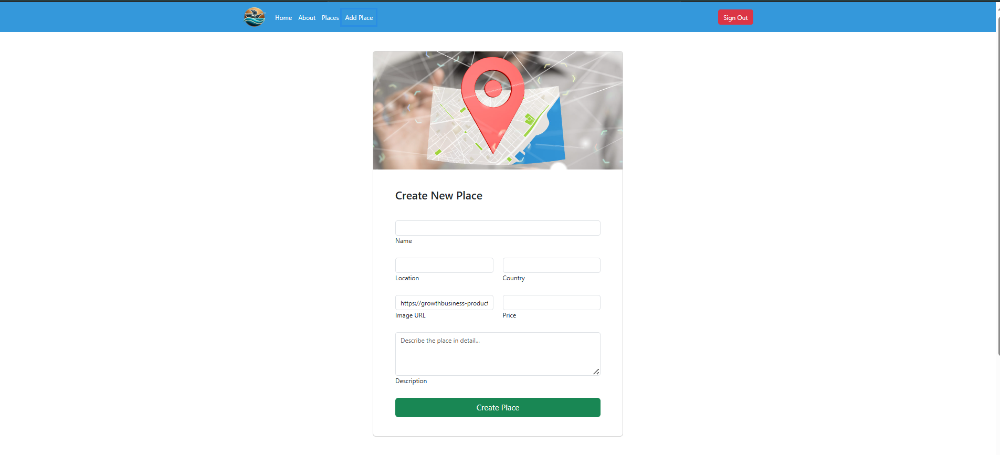

# Gulf Wonder 🌍✨  

[Live Demo](https://gulf-wonder-frontend-dgz5.vercel.app/) | [Trello Board](#)  

## Project Description  

**Gulf Wonder** is a tourism web application designed to showcase and promote attractions across the Gulf region. Built using the **MERN stack**, Gulf Wonder allows users to explore tourist destinations, book tours, and leave reviews.  

### With Gulf Wonder, users can:  
✅ Discover tourist spots in Bahrain, UAE, Saudi Arabia, Qatar, Kuwait, and Oman.  
✅ Browse destinations by country, attraction type, and visitor ratings.  
✅ Sign up and sign in to book tours and leave reviews.  
✅ View detailed descriptions, images, and locations of attractions.  

## Technologies Used  

- **Frontend:** React, Tailwind CSS  
- **Backend:** Node.js, Express.js  
- **Database:** MongoDB  
- **Authentication:** JWT  

---

## Screenshots  
### **Home Page**  

### **About Page**  
  

### **Places Page**  

### **Places Details Page (Admin)**  
 

### **Add Places Page (Admin)**  

### **Sign Up & Sign In Pages**  
 |   

### **Booking Page**  
  

### **User Dashboard**  
  

---

## Next Steps:  
🚀 Implement a **search functionality** for tourist spots.  
⭐ Add a **"My Bookings"** page for users to track their tours.  
💬 Introduce a **review & rating system** for destinations.  
📍 Integrate **Google Maps API** to show exact locations. 